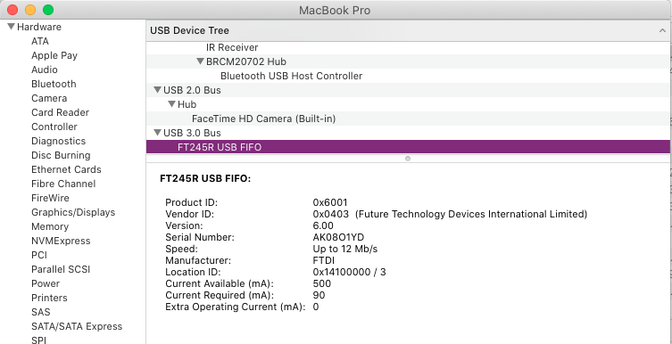

# UNFLoader
**The code in this repo might be unstable! For stable versions, head to the [releases page](https://github.com/buu342/N64-UNFLoader/releases)**

UNFLoader is a USB ROM uploader (and debugging) tool designed to unify developer flashcarts for the Nintendo 64. The goal of this project is to provide developers with USB I/O functions that work without needing to worry about the target flashcart, provided by a single C file (`usb.c`) targeting libultra. I have also implemented a very basic debug library (`debug.c`) that makes use of said USB library.
Currently supported devices:
* 64Drive Hardware 1.0 (No longer comercially sold), using firmware 2.05+
* [64Drive Hardware 2.0](http://64drive.retroactive.be/), using firmware 2.05+
* EverDrive 3.0 (No longer comercially sold), using OS version 3.04+
* [EverDrive X7](https://krikzz.com/store/home/55-everdrive-64-x7.html), using OS version 3.04+
* [SummerCart64](https://github.com/Polprzewodnikowy/SummerCollection), only N64 -> PC debug supported


### Requirements:
<details><summary>Windows</summary>
<p>
    
* Windows XP or higher
* [The Windows version of this FDTI driver](https://www.ftdichip.com/Drivers/D2XX.htm). If you are on Windows XP, be sure you download the XP driver and not the first one.
</p>
</details>
    
<details><summary>Linux</summary>
<p>
    
* Ubuntu (Haven't tested with others)
* [The relevant FTDI driver for your processor architecture](https://www.ftdichip.com/Drivers/D2XX.htm) (Check the README inside the downloaded tar for install instructions)
* You must run UNFLoader with `sudo`.
* Due to how Linux defaultly sets the vcp driver when plugging in FTDI devices, you need to invoke these commands every time you start a new terminal session: 
```
sudo rmmod usbserial
sudo rmmod ftdi_sio
```
</p>
</details>

<details><summary>macOS</summary>
<p>
    

* Connect your flashcart to your computer via a Micro-USB cable. Confirm that the corresponding FTDI USB device appears in **System Information** window.
* Run the **D2xxHelper** installer from [the **Comments** column](https://www.ftdichip.com/Drivers/D2XX.htm) before installing the FTDI driver.
* [The macOS FTDI driver available here](https://www.ftdichip.com/Drivers/D2XX.htm).
* Once you've run **D2xxHelper** and installed the FTDI driver, restart your computer. This is necessary to have the driver working.
* You must run UNFLoader with `sudo`.
</p>
</details>

### Using UNFLoader
Simply execute the program for a full list of commands. If you run the program with the `-help` argument, you have access to even more information (such as how to upload via USB with your specific flashcart). 
The most basic usage is `UNFLoader.exe -r PATH/TO/ROM.n64`. 

Append `-d` to enable debug mode, which allows you to receive/send input from/to the console (Assuming you're using the included USB+debug libraries). If you wrap a part of a command in '@' characters, the data will be treated as a file and will be uploaded to the cart. When uploading files in a command, the filepath wrapped between the '@' characters will be replaced with the size of the data inside the file, with the data in the file itself being appended after. For example, if there is a file called `file.txt` with 4 bytes containing `abcd`, sending the following command: `commandname arg1 arg2 @file.txt@ arg4` will send `commandname arg1 arg2 @4@abcd arg4` to the console.

Append `-l` to enable listen mode, which will automatically reupload a ROM once a change has been detected.


### Using the USB Library
Simply include the `usb.c` and `usb.h` in your project. You must call `usb_initialize()` once before doing anything else. The library features a read and write function for USB communication. You can edit `usb.h` to configure some aspects of the library.
<details><summary>Included functions list</summary>
<p>
    
```c
/*==============================
    usb_initialize
    Initializes the USB buffers and pointers
    @return 1 if the USB initialization was successful, 0 if not
==============================*/
char usb_initialize();

/*==============================
    usb_getcart
    Returns which flashcart is currently connected
    @return The CART macro that corresponds to the identified flashcart
==============================*/
char usb_getcart();

/*==============================
    usb_write
    Writes data to the USB.
    Will not write if there is data to read from USB
    @param The DATATYPE that is being sent
    @param A buffer with the data to send
    @param The size of the data being sent
==============================*/
void usb_write(int datatype, const void* data, int size);

/*==============================
    usb_poll
    Returns the header of data being received via USB
    The first byte contains the data type, the next 3 the number of bytes left to read
    @return The data header, or 0
==============================*/
u32 usb_poll();

/*==============================
    usb_read
    Reads bytes from USB into the provided buffer
    @param The buffer to put the read data in
    @param The number of bytes to read
==============================*/
void usb_read(void* buffer, int size);

/*==============================
    usb_skip
    Skips a USB read by the specified amount of bytes
    @param The number of bytes to skip
==============================*/
void usb_skip(int nbytes);

/*==============================
    usb_rewind
    Rewinds a USB read by the specified amount of bytes
    @param The number of bytes to rewind
==============================*/
void usb_rewind(int nbytes);

/*==============================
    usb_purge
    Purges the incoming USB data
==============================*/
void usb_purge();

// Use these to conveniently read the header from usb_poll()
#define USBHEADER_GETTYPE(header)
#define USBHEADER_GETSIZE(header)
```
</p>
</details>

### Using the Debug Library
The debug library is a basic practical implementation of the USB library. Simply include the `debug.c` and `debug.h` in your project. You must call `debug_initialize()` once before doing anything else. If you are using this library, there is no need to worry about anything regarding the USB library as this one takes care of everything for you (initialization, includes, etc...). You can edit `debug.h` to enable/disable debug mode (which makes your ROM smaller if disabled), as well as configure other aspects of the library. The library features some basic debug functions and two threads: one that handles all USB calls, and another that catches `OS_EVENT_FAULT` events and dumps registers through USB. The library runs in its own thread, it blocks the thread that called a debug function until it is finished reading/writing to the USB.
<details><summary>Included functions list</summary>
<p>
    
```c
/*==============================
    debug_initialize
    Initializes the debug and USB library.
==============================*/
void debug_initialize();

/*==============================
    debug_printf
    Prints a formatted message to the developer's command prompt.
    Supports up to 256 characters.
    @param A string to print
    @param variadic arguments to print as well
==============================*/
void debug_printf(const char* message, ...);

/*==============================
    debug_screenshot
    Sends the currently displayed framebuffer through USB.
    @param The size of each pixel of the framebuffer in bytes
           Typically 4 if 32-bit or 2 if 16-bit
    @param The width of the framebuffer
    @param The height of the framebuffer
==============================*/
void debug_screenshot(int size, int w, int h);

/*==============================
    debug_assert
    Halts the program if the expression fails.
    @param The expression to test
==============================*/
#define debug_assert(expr)

/*==============================
    debug_pollcommands
    Check the USB for incoming commands.
==============================*/
void debug_pollcommands();

/*==============================
    debug_addcommand
    Adds a command for the USB to read.
    @param The command name
    @param The command description
    @param The function pointer to execute                                                                                  
==============================*/
void debug_addcommand(char* command, char* description, char*(*execute)());

/*==============================
    debug_parsecommand
    Stores the next part of the incoming command into the provided buffer.
    Make sure the buffer can fit the amount of data from debug_sizecommand!
    If you pass NULL, it skips this command.
    @param The buffer to store the data in
==============================*/
void debug_parsecommand(void* buffer);

/*==============================
    debug_sizecommand
    Returns the size of the data from this part of the command.
    @return The size of the data in bytes, or 0
==============================*/
int debug_sizecommand();

/*==============================
    debug_printcommands
    Prints a list of commands to the developer's command prompt.
==============================*/
void debug_printcommands();
```
</p>
</details>
         
### Important implementation details
<details><summary>USB Library</summary>
<p>

**General**

* Due to the data header, a maximum of 8MB can be sent through USB in a single `usb_write` call.
* By default, the USB Buffers are located on the 63MB area in SDRAM, which means that it will overwrite ROM if your game is larger than 63MB. More space can be allocated by changing `usb.h`.
* Avoid using `usb_write` while there is data that needs to be read from the USB first, as this will cause lockups for 64Drive users and will potentially overwrite the USB buffers on the EverDrive. Use `usb_poll` to check if there is data left to service. If you are using the debug library, this is handled for you.


**64Drive**

* All data through USB is 4 byte aligned. This might result in up to 3 extra bytes being sent/received through USB, which will be padded with zeroes.


**EverDrive**

\<Nothing>


</p>
</details>

<details><summary>Debug Library</summary>
<p>

* The debug library runs on a dedicated thread, which will only execute if invoked by debug commands. All threads will be blocked until the USB thread is finished.
* Incoming USB data must be serviced first before you are able to write to USB. Every time a debug function is used, the library will first ensure there is no data to service before continuing. This means that incoming USB data **will only be read if a debug function is called**. Therefore, it is recommended to call `debug_pollcommands` as often as possible to ensure that data doesn't stay stuck waiting to be serviced. See Example 3 or 4 for examples on how to read incoming data.
</p>
</details>

### Building UNFLoader
<details><summary><b>Building UNFLoader for Windows</b></summary>
Simply load the project file in Visual Studio 2019 or higher. The <a href="https://docs.microsoft.com/en-us/cpp/build/configuring-programs-for-windows-xp?view=msvc-160">Windows XP toolset</a> needs to be installed, as it is optional in VS 2019.

**The Include folder should already have everything you need for Windows.**
<details><summary>Updating libs to latest version (if required)</summary>

**pdcurses.lib**
* Grab the latest version of PDCurses from [here](https://github.com/wmcbrine/PDCurses).
* Extract the contents of the zip (preferrably somewhere with no spaces in the file path, like `c:\pdcurses`).
* Open the Visual Studio Command Prompt (Tools->Command Line->Developer Command Prompt).
* Run the command `set PDCURSES_SRCDIR=c:\PATH\TO\pdcurses`, obviously replacing the path with your one.
* CD into the `pdcurses/wincon` folder.
* Run the command `nmake -f Makefile.vc` to build pdcurses.
* Copy the `pdcurses.lib` that was compiled from the wincon folder to `UNFLoader/Include`, replacing the pdcurses library in there.
* Copy the `curses.h`, `curspriv.h`, and `panel.h` from the pdcurses directory and put them in `UNFLoader/Include`.
* Open `curses.h` and uncomment the line with `#define MOUSE_MOVED` to fix a warning due to `wincon.h`.

**ftd2xx.lib**
* Download the FTDI driver provided in the **Requirements** section and extract the executable from the zip.
* This is a self extracting executable, meaning you can open the .exe with with a zip program. 
* Grab `ftd2xx.h` and put it in `UNFLoader/Include`.
* Grab `ftd2xx.lib` from `i386` or `amd64` (depending on your CPU architecture) and put it in `UNFLoader/Include`.

**lodepng**
* Download the latest version of LodePNG from [here](https://lodev.org/lodepng/).
* Place `lodepng.cpp` and `lodepng.h` in `UNFLoader/Include`.
</br>
Once you have all of these files built and put in the `Include` folder, you're set to compile!
</details>
</p>
</details>

<details><summary><b>Building UNFLoader for Linux</b></summary>
<p>
You need to have the FTDI driver installed, as well as ncurses.
Install ncurses by invoking:

```
sudo apt-get install libncurses5-dev libncursesw5-dev
```

Once the dependencies are installed, simply execute the makefile:

```
make -f Makefile
```

**The Include folder should already have everything you need for Linux.**
<details><summary>Updating libs to latest version (if required)</summary>

**ftd2xx + WinTypes**
* Download the FTDI driver provided in the **Requirements** section and extract the zip.
* Go into the `release` folder.
* Grab `ftd2xx.h` and `WinTypes.h` and put it in `UNFLoader/Include`.

**lodepng**
* Download the latest version of LodePNG from [here](https://lodev.org/lodepng/).
* Place `lodepng.cpp` and `lodepng.h` in `UNFLoader/Include`.

</br>
Once you have all of these files built and put in the `Include` folder, you're set to compile!
</details>
</p>
</details>

### Extending the libraries/loader program
All data gets sent in the following manner:
* 4 Bytes with `'D' 'M' 'A' '@'` to signalize data start.
* 4 Bytes with 1 byte for the data type and 3 for the size of the data.
* N bytes with the data.
* 4 bytes with `'C' 'M' 'P' 'H'` to signalize data end.

The data type mentioned is up to the developer to implement. If you wish to add more data types so that the data is handled differently on the PC side, you must make changes to UNFLoader's `debug.c` file to add support for said command (check the `debug_main()` function's switch statement). Make sure you also add your new data types to the USB library's `usb.h`! Here's a list of default data types:
```c
// Incoming data is text for printf
#define DATATYPE_TEXT       0x01

// Incoming data is raw binary
#define DATATYPE_RAWBINARY  0x02

// Incoming data describes contents of next incoming data
// Use to help you process the data that comes after it (see screenshot implmentation)
#define DATATYPE_HEADER     0x03

// Incoming data is a framebuffer
#define DATATYPE_SCREENSHOT 0x04
```
There is no checksum in place to detect the authenticity of the data. This might be implemented at a later date...


### Known issues

All known issues are mentioned in the [issues page](https://github.com/buu342/N64-UNFLoader/issues). Suggestions also belong there.


### Credits
Marshallh for providing the 64Drive USB application code which this program was based off of.

KRIKzz, saturnu, networkfusion, lambertjamesd, and jsdf for providing sample code for the EverDrive 3.0 and/or X7.

fraser and networkfusion for all the help provided during the development of this project as well as their support.

networkfusion for lending me his remote test rig for the ED3 and X7.

danbolt for helping test this on Debian, as well as providing changes to get the tool compiling under macOS.

korgeaux for implementing support for his SummerCart64.

CrashOveride for ensuring the samples compile on his Linux libultra port. 

This project uses [lodePNG](https://github.com/lvandeve/lodepng) by Lode Vandevenne, [ncurses](https://invisible-island.net/ncurses/) by the GNU Project, [pdcurses](https://github.com/wmcbrine/PDCurses) by William McBrine, and the [D2XX drivers](https://www.ftdichip.com/Drivers/D2XX.htm) by FTDI.

The folk at N64Brew for being patient with me and helping test the program! Especially command_tab, networkfusion, CrashOveride, gravatos, PerKimba, manfried and kivan117. You guys are the reason this project was possible!