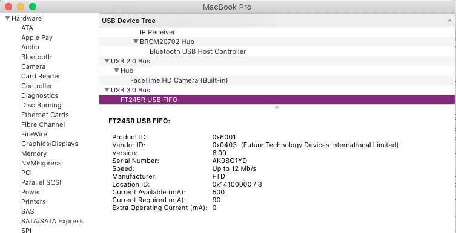

# UNFLoader Program

This folder holds the source code for the UNFLoader program itself. This readme contains information on how to use, and how to build UNFLoader for Windows, macOS, and Linux operating systems.
</br>
</br>
### Table of Contents
* [System Requirements](#system-requirements)
* [How to use UNFLoader](#how-to-use-unfloader)
* [How to Build UNFLoader for Windows](#how-to-build-unfloader-for-windows)
* [How to Build UNFLoader for macOS](#how-to-build-unfloader-for-macos)
* [How to Build UNFLoader for Linux](#how-to-build-unfloader-for-linux)
</br>

### System Requirements
<details><summary>Windows</summary>
<p>
    
* Windows XP or higher
    * Windows XP users should be on the latest Service Pack
* [The Windows version of this FDTI driver](https://www.ftdichip.com/Drivers/D2XX.htm). If you are on Windows XP, be sure you download the XP driver and not the first one.
</p>
</details>
    
<details><summary>Linux</summary>
<p>
    
* Ubuntu (Haven't tested with others)
* Run the included `installer_linux.sh` script to set up everything for you. If you are unable to launch the script, remember to mark it as executable.

If you do not wish to run the script, then you must:
* [Get the relevant FTDI driver for your processor architecture](https://www.ftdichip.com/Drivers/D2XX.htm) (Check the README inside the downloaded tar for install instructions)
* You must run UNFLoader with `sudo`.
* Due to how Linux defaultly sets the vcp driver when plugging in FTDI devices, you need to invoke these commands every time you start a new terminal session: 
```
sudo rmmod usbserial
sudo rmmod ftdi_sio
```
</p>
</details>

<details><summary>macOS</summary>
<p>
    

* Connect your flashcart to your computer via a Micro-USB cable. Confirm that the corresponding FTDI USB device appears in **System Information** window.
* Run the **D2xxHelper** installer from [the **Comments** column](https://www.ftdichip.com/Drivers/D2XX.htm) before installing the FTDI driver.
* [The macOS FTDI driver available here](https://www.ftdichip.com/Drivers/D2XX.htm).
* Once you've run **D2xxHelper** and installed the FTDI driver, restart your computer. This is necessary to have the driver working.
* You must run UNFLoader with `sudo`.
* If you grabbed a pre-built UNFLoader binary (AKA you didn't compile it yourself from the source code), you'll have to deal with the fact that macOS prevents running unsigned binaries by default. To fix this, go to the Security & Privacy panel in the System Preferences menu and explicitly allow UNFLoader to be run.
</p>
</details>
</br>

### How to use UNFLoader
Simply execute the program for a full list of commands. If you run the program with the `-help` argument, you have access to even more information (such as how to upload via USB with your specific flashcart). 
The most basic usage is `UNFLoader.exe -r PATH/TO/ROM.n64`. 

Append `-d` to enable debug mode, which allows you to receive/send input from/to the console (Assuming you're using the included USB+debug libraries). If you wrap a part of a command in '@' characters, the data will be treated as a file and will be uploaded to the cart. When uploading files in a command, the filepath wrapped between the '@' characters will be replaced with the size of the data inside the file, with the data in the file itself being appended after. For example, if there is a file called `file.txt` with 4 bytes containing `abcd`, sending the following command: `commandname arg1 arg2 @file.txt@ arg4` will send `commandname arg1 arg2 @4@abcd arg4` to the console. UNFLoader only supports sending 1 file per command.

Append `-l` to enable listen mode, which will automatically reupload a ROM once a change has been detected. **For listen mode to work, the console needs to be in a safe state**. This means that 64Drive users should have the console turned off, EverDrive users should have the console turned on and waiting on the menu, etc...

Append `-g` to open a GDB server. By default, the address `127.0.0.1:8080` is used. You can specify the address by adding it to the argument: `-g 192.168.1.68:27015`. You can also just specify a port: `-g 69420` or address `-g 192.168.1.68`. 
</br>
</br>
### How to Build UNFLoader for Windows
Simply load the project file in Visual Studio 2019 or higher. The <a href="https://docs.microsoft.com/en-us/cpp/build/configuring-programs-for-windows-xp?view=msvc-160">Windows XP toolset</a> needs to be installed, as it is optional in VS 2019.

**The Include folder should already have everything you need for Windows.**
<details><summary>Updating libs to latest version (if required)</summary>

**pdcurses.lib**
* Grab the latest version of PDCurses from [here](https://github.com/wmcbrine/PDCurses).
* Extract the contents of the zip (preferrably somewhere with no spaces in the file path, like `c:\pdcurses`).
* Open the Visual Studio Command Prompt (Tools->Command Line->Developer Command Prompt).
* Run the command `set PDCURSES_SRCDIR=c:\PATH\TO\pdcurses`, obviously replacing the path with your one.
* CD into the `pdcurses/wincon` folder.
* Run the command `nmake -f Makefile.vc` to build pdcurses.
* Copy the `pdcurses.lib` that was compiled from the wincon folder to `UNFLoader/Include`, replacing the pdcurses library in there.
* Copy the `curses.h`, `curspriv.h`, and `panel.h` from the pdcurses directory and put them in `UNFLoader/Include`.
* Open `curses.h` and uncomment the line with `#define MOUSE_MOVED` to fix a warning due to `wincon.h`.

**ftd2xx.lib**
* Download the FTDI driver provided in the **Requirements** section and extract the executable from the zip.
* This is a self extracting executable, meaning you can open the .exe with with a zip program. 
* Grab `ftd2xx.h` and put it in `UNFLoader/Include`.
* Grab `ftd2xx.lib` from `i386` or `amd64` (depending on your CPU architecture) and put it in `UNFLoader/Include`.

**lodepng**
* Download the latest version of LodePNG from [here](https://lodev.org/lodepng/).
* Place `lodepng.cpp` and `lodepng.h` in `UNFLoader/Include`.

Once you have all of these files built and put in the `Include` folder, you're set to compile!
</details>
</br>

### How to Build UNFLoader for macOS
You need to have the FTDI driver installed (This is in the [requirements](#system-requirements) section so you should've already done this step), as well as ncurses. ncurses should come with your stock macOS, but it can be an old revision. If you want to update it, you can do so by invoking
Install ncurses by invoking:

```
brew install ncurses
```

Once the dependencies are installed, simply execute the makefile:

```
make
```

**The Include folder should already have everything you need for macOS.**
<details><summary>Updating libs to latest version (if required)</summary>

**ftd2xx + WinTypes**
* Download the FTDI driver provided in the **Requirements** section and extract the zip.
* Go into the `release` folder.
* Grab `ftd2xx.h` and `WinTypes.h` and put it in `UNFLoader/Include`.

**lodepng**
* Download the latest version of LodePNG from [here](https://lodev.org/lodepng/).
* Place `lodepng.cpp` and `lodepng.h` in `UNFLoader/Include`.

Once you have all of these files built and put in the `Include` folder, you're set to compile!
</details>
</br>

### How to Build UNFLoader for Linux
You need to have the FTDI driver installed (This is in the [requirements](#system-requirements) section so you should've already done this step), as well as ncurses.
Install ncurses by invoking:

```
sudo apt-get install libncurses5-dev libncursesw5-dev
```

Once the dependencies are installed, simply execute the makefile:

```
make
```

If you haven't done so previously, it is recommended that you run `installer_linux.sh`. 

You can optionally install UNFLoader to `/usr/local/bin` (which will let you execute the tool in any folder, just remember to use `sudo`!) by calling:
```
sudo make install
```

and uninstall with:
```
sudo make uninstall
```
</br>

**The Include folder should already have everything you need for Linux.**
<details><summary>Updating libs to latest version (if required)</summary>

**ftd2xx + WinTypes**
* Download the FTDI driver provided in the **Requirements** section and extract the zip.
* Go into the `release` folder.
* Grab `ftd2xx.h` and `WinTypes.h` and put it in `UNFLoader/Include`.

**lodepng**
* Download the latest version of LodePNG from [here](https://lodev.org/lodepng/).
* Place `lodepng.cpp` and `lodepng.h` in `UNFLoader/Include`.

Once you have all of these files built and put in the `Include` folder, you're set to compile!
</details>